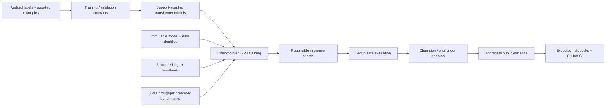

# Case study · Rule-conditioned moderation NLP

**Role:** end-to-end ML/AI research and engineering  
**Domain:** NLP / policy-conditioned classification  
**Stack:** Python, PyTorch, Transformers, PEFT/LoRA, scikit-learn, AWS SageMaker, Plotly, Jupyter, GitHub Actions  
**Verified result:** **0.91808 public / 0.91425 private ROC AUC**  
**Measured improvement:** **+0.29469 private AUC** over the project’s lexical baseline

This case study is the fastest technical review of the project. It focuses on the decisions, validation, engineering, and results that best demonstrate applied ML ownership. Detailed experiment evidence remains available in the notebooks and research reports.

## The problem

The task is not generic toxicity detection. Each comment must be evaluated against a **supplied community rule**, and the same text can be acceptable under one rule and violate another.

That changes the modeling problem in three important ways:

- the decision is conditional on natural-language policy text;
- positive and negative support examples provide task context at inference time;
- generalization to unfamiliar policies matters more than memorizing frequent lexical patterns.

The project therefore treats rule understanding, support conditioning, transfer validation, and model complementarity as first-class design problems.

## The result

The retained scored system uses a support-adapted Qwen3-4B model and achieved:

| Evaluation | ROC AUC |
| --- | ---: |
| Public | **0.91808** |
| Private | **0.91425** |
| Private improvement over lexical baseline | **+0.29469** |

The development research program later produced a stronger multi-backbone ensemble on the fixed internal cohort and a promising Llama challenger. Those development results are kept separate from official scored results and are not presented as leaderboard-equivalent evidence.

## What I built

### 1. A rule-conditioned neural ranking system

The retained path combines:

- a Qwen3 instruction-tuned backbone;
- LoRA adaptation on legitimate labeled examples and supplied support examples;
- decision-position supervision rather than full-sequence language-model loss;
- forward-only answer scoring;
- stable length-sorted inference with restored row order;
- within-policy ranking for the final score representation.

The goal was to make the model reason about the **relationship between a comment and a supplied rule**, rather than learn a generic toxicity shortcut.

### 2. A transfer-aware validation framework

A large part of the project is validation engineering.

The evaluation framework includes:

- familiar-policy and held-out-policy views;
- normalized-text overlap controls;
- train/validation support-text purging;
- group-safe out-of-fold predictions;
- fixed incumbent comparisons;
- policy-macro ROC AUC;
- paired/grouped bootstrap uncertainty;
- explicit promotion and kill gates.

Development results are labeled as development evidence. Official competition scores remain separate.

This distinction matters because a model can improve a point estimate while still fail the stability or uncertainty criteria required for promotion.

### 3. A multi-backbone ensemble research program

The project evaluates model families for **complementary errors**, not only standalone accuracy.

Research includes:

- Qwen3-4B;
- Qwen3-8B;
- Qwen3-14B;
- Qwen2.5-14B;
- Phi-4-mini;
- Llama-family support adaptation;
- DeBERTa and NLI formulations;
- ModernBERT/Ettin encoder experiments.

The strongest accepted development ensemble combines multiple backbones after group-safe comparison and stability testing.

The research repeatedly showed that a larger model is not automatically a better system. Several weaker standalone models still provided useful ensemble diversity, while other seemingly promising architectures were rejected.

### 4. A controlled frontier experiment program

After the strongest ensemble was established, the project tested materially different mechanisms rather than endlessly tuning one family.

The program includes:

- support adaptation;
- pseudo-supervision;
- teacher/student soft-label transfer;
- hard-negative representation transfer;
- pairwise ranking continuation;
- semantic support retrieval;
- asymmetric retrieval;
- multi-view support context;
- bidirectional encoder adaptation;
- pretrained entailment transfer;
- rule-clause decomposition.

Most of these later experiments were not promoted.

That is a feature of the project, not a weakness: each experiment was designed to answer a specific question, and negative results were retained when they reduced uncertainty.

## A representative model-governance decision

A support-adapted Llama challenger reached **0.743436 policy-macro AUC** on the repeatedly inspected development cohort versus **0.740351** for the accepted development incumbent.

It was **not promoted**.

Why? The point estimate improved, but the registered uncertainty gate did not clear.

That decision captures the project’s model-governance philosophy:

> a newer or higher-scoring model does not replace the incumbent until the evidence is strong enough.

The same rule was applied to ranking, retrieval, context, encoder, and entailment experiments.

## Engineering architecture

The scientific work runs inside an AWS-first execution system designed for long-running GPU experiments.

### Reliability features

The workflow includes:

- pinned model revisions;
- content-addressed source/data identities;
- checksum verification;
- resumable optimizer state;
- resumable prediction shards;
- atomic result publication;
- structured JSONL logs;
- human-readable heartbeats;
- cost telemetry;
- memory and disk gates;
- GPU batch-size benchmarking;
- regression tests for previously observed failures.

This prevents expensive experiments from silently restarting or producing ambiguous evidence after partial failure.

## GPU and performance engineering

The project uses AWS SageMaker with NVIDIA L4-class GPU execution for the current research workflow.

Performance work includes:

- representative long-sequence benchmarks before expensive stages;
- safe microbatch selection;
- gradient accumulation;
- gradient checkpointing;
- mixed-precision execution where numerically appropriate;
- GPU-memory and host-memory telemetry;
- checkpoint-safe timeout handling;
- avoiding CPU/thread oversubscription;
- reuse of verified cached model/data assets.

Performance decisions are treated as part of experiment correctness because faster settings are rejected when they materially alter predictions or gradients.

## Reproducibility without publishing private competitive state

The repository is deliberately **semi-reproducible**.

### Public on GitHub

- reusable source modules;
- compact configuration contracts;
- validation and metric code;
- aggregate experiment evidence;
- model/data cards;
- executed analytical notebooks;
- regression tests;
- GitHub Actions quality gates;
- machine-readable aggregate receipts.

### Private in AWS

- raw competition comments and labels;
- row-level predictions;
- model and optimizer checkpoints;
- exact private ensemble construction;
- teacher-score arrays;
- large caches;
- full operational logs.

This boundary lets an employer inspect engineering quality and scientific reasoning without turning the repository into a complete competitive artifact dump.

## Quality gates

The repository’s CI validates more than unit tests.

The current quality workflow covers:

- Python compilation;
- Ruff lint and formatting;
- pytest;
- reproducible notebook construction;
- execution of the public evidence notebooks;
- checkpoint reuse;
- synthetic offline inference;
- original-preview notebook verification;
- pinned encoder verification;
- public evidence rendering.

Portfolio updates are merged only after the exact pull-request head passes the full workflow.

## What the project demonstrates

| Capability | Evidence |
| --- | --- |
| **End-to-end ML ownership** | problem framing → data audit → model adaptation → validation → GPU execution → ensemble selection → publication |
| **Modern NLP / LLM work** | Qwen, Llama, Phi, DeBERTa, ModernBERT/Ettin, PEFT/LoRA, retrieval, NLI, teacher/student methods |
| **Scientific judgment** | controlled ablations, matched controls, uncertainty gates, preserved negative results |
| **Validation rigor** | whole-policy transfer views, text purging, group-safe OOF evaluation, metric separation |
| **ML engineering** | resumability, immutable provenance, GPU benchmarking, checkpointing, failure recovery |
| **Cloud execution** | AWS SageMaker as the canonical research environment |
| **Reproducibility** | pinned identities, aggregate receipts, executed notebooks, regression tests, CI |
| **Communication** | outcome-first README, model/data cards, review paths, research summaries |

## Strongest lessons

**Model size is not a strategy.** Larger standalone models were sometimes weaker, while complementary models improved the ensemble.

**Validation design can matter more than a small metric gain.** A higher development score is not sufficient when uncertainty or policy-specific behavior is weak.

**Support context is useful only when the model and distribution support it.** More examples, retrieval, or multi-view context can hurt.

**Negative experiments create value when they close a direction.** The project records failed hypotheses so subsequent work can move to genuinely different mechanisms.

**Operational reliability is part of model quality.** Checkpoints, hashes, memory gates, and regression tests directly reduce wasted compute and ambiguous results.

## Review path

For a deeper technical review:

1. [Project overview notebook](notebooks/27_latest_system_checkpoint.ipynb) — retained system and overall research narrative.
2. [Five-model frontier notebook](notebooks/29_five_model_frontier_review.ipynb) — multi-backbone complementarity and ensemble discipline.
3. [Validation notebook](notebooks/01_data_and_validation.ipynb) — leakage controls and transfer evaluation.
4. [Post-closeout frontier](docs/POST_CLOSEOUT_FRONTIER.md) — ranking, retrieval, context, encoder, and NLI studies.
5. [Model card](MODEL_CARD.md) and [data card](DATA_CARD.md) — intended use, evidence boundaries, and limitations.

## Bottom line

This project is an end-to-end applied ML system, not a single competition notebook. It demonstrates the combination of **NLP modeling, experimental design, statistical validation, AWS/GPU engineering, reproducibility, and model-governance judgment** expected in serious ML engineering and applied-science work.
