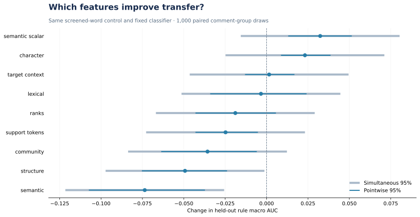
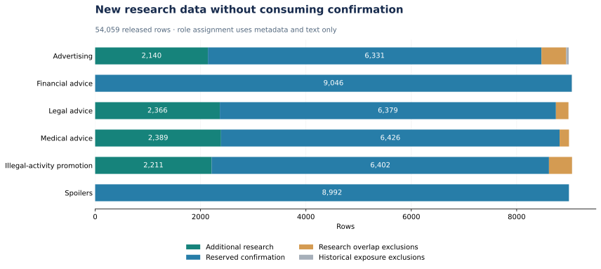

# Jigsaw · Rule-conditioned comment classification

Predict whether a comment violates a supplied community rule, using the policy text and examples of permitted and prohibited comments.

**Start with [03 · Results and decision](notebooks/03_saved_results.ipynb), then [02 · Feature research](notebooks/02_baseline_and_review.ipynb).** The project treats feature engineering as an explicit completion gate. It has executed a broad feature search; it has not established a final model or an independent generalization claim. [Three remaining release milestones](docs/ROADMAP.md#next-three-deliverables).

[](https://github.com/alvaromendizabal/jigsaw-rule-classifier/actions/workflows/quality.yml)

Built by Alvaro Mendizabal. The work combines rule-conditioned NLP, training-only feature screening, nested target encodings, frozen representations, matched ablations, uncertainty, and resumable cloud experiments. No leaderboard score, medal or state-of-the-art result is claimed.

## Research at a glance

- **Completed experiments: 2,029 labeled comments, two rule types, 100 communities.** Both familiar-rule and held-out-rule validation use saved, duplicate-purged splits.
- **New research boundary: 54,059 host-released rows, six policies.** A committed text-only partition prepares 9,106 additional research rows across four policies and reserves 43,576 rows, including two whole policy types. The new feature study has not run.
- **89,059–104,800 candidate columns per fold** across the broad, NLI and instruction banks; **4,919–7,975 retained** before final family selection. Five additional 128-component low-rank alternatives test compression of already-counted matrices.
- **105 broad-study fits**, **55 sensitivity/control fits**, **25 frozen-NLI feature fits**, **10 near-copy stress fits**, and **15 instruction-feature fits**, with fixed classifier settings. Earlier references and the four-candidate study are preserved.
- Matched family additions, leave-one-family-out ablations, within-rule permutation, coefficient contributions, selection stability, and paired pointwise/simultaneous uncertainty.
- Pinned model revisions, completed-stage hashes, private OOF verification, encrypted S3 checkpoints, canonical executed notebooks, and Plotly figures with static SVG fallbacks.



The figure compares additions to the **same screened-word control**. Intervals condition on two observed policies and fixed OOF predictions. Even within-study simultaneous intervals do not correct all adaptive research selection.

## What the features achieved

These are **local rule-macro ROC AUC** results, not Kaggle scores. Lower log loss and Brier are better.

| Representation | Held-out AUC ↑ | Log loss ↓ | Brier ↓ |
| --- | ---: | ---: | ---: |
| Historical rule/example TF-IDF reference | 0.6156 | 0.6736 | 0.2405 |
| Screened words + compact semantic geometry | 0.6217 | 0.7248 | 0.2604 |
| Full character vocabulary | 0.6235 | 0.6646 | 0.2361 |
| Frozen normalized Qwen centroid margin | 0.6416 | 0.6693 | 0.2385 |
| All transferable broad feature families | 0.5543 | 1.2933 | 0.3399 |
| Screened words + frozen NLI features | 0.5964 | 0.6964 | 0.2475 |
| Screened words + fixed instruction likelihoods | 0.5755 | 0.6958 | 0.2495 |

Compact semantic geometry and character patterns are the most promising tested families. The centroid's observed improvement over the historical reference is **+0.0260 AUC**, with a pointwise paired 95% interval of **−0.0056 to +0.0578**. Its gain comes from advertising; legal-advice AUC declines slightly. It remains an exploratory candidate, without independent confirmation or improvement across both held-out policies.

Negative findings are retained: high-dimensional structural expansion, raw embedding-coordinate selection, community/target encodings, NB weighting, low-rank alternatives and the tested frozen NLI/instruction representations do not establish a better transfer model. A larger feature bank performs worse; model complexity is not used to conceal that result. [Complete study and feature catalog](docs/FEATURE_RESEARCH.md).

## Validation and leakage prevention

**Familiar-rule CV** stratifies by rule and target while grouping normalized duplicate comments. **Held-out-rule CV** excludes the evaluated rule from training. Both remove training rows whose comment or examples contain a validation comment. This strict policy leaves only 237–287 training rows in the familiar-rule folds, an explicit limitation.

Vocabulary, IDF, scaling, ranks, screening, low-rank projections and NB weights use retained training rows only. Target/context features use inner comment-group cross-fitting, including inner example purging and inner-only priors. Supplied support examples are inference inputs, not additional copies of the target label. The frozen encoders do not fit competition labels.

Eighteen comments match their own support examples; an exclusion sensitivity preserves the main semantic ranking pattern. A fixed approximate-copy audit found no additional cross-fold copies after exact purging, without claiming paraphrase isolation. No timestamps or historical entities exist in this schema: rolling, lag, season, coaching and opponent features would be fabricated. Published feature experiments use the original training data and pinned encoders; the newly prepared released-data cohort has separate provenance.

The competition describes **column-averaged AUC**. The [host's per-rule score release](https://www.kaggle.com/competitions/jigsaw-agile-community-rules/discussion/641121) strongly corroborates this project's equal-weight **rule macro ROC AUC**: 2,428 of 2,437 complete score rows agree within 1e-6. Nine discrepancies and six incomplete rows remain disclosed in the [arithmetic audit](reports/released/metric.json). Executable scorer parity and a project leaderboard score are not claimed. Pooled AUC is separate; supporting metrics include per-rule AUC, average precision, log loss, Brier and calibration diagnostics.

## Completion gate and current decision

**Feature gate: OPEN. Retain the lexical reference.** A successful pipeline and a large feature count cannot establish broad policy transfer. Completed experiments repeatedly compare the same two policies. The host release now enables a four-policy research round while preserving financial-advice and spoiler policies for later confirmation. Independent confirmation, final feature selection, calibration and final-model promotion remain incomplete.



The additional research rows have passed exact comment/support isolation. Together with the original data they provide 11,135 development rows before duplicate handling; the audit identifies 544 repeated body/policy rows and 39 conflicting-label groups. Reserved targets have not been scored or used for feature selection. This is a public post-competition benchmark with a protocol reserve, not a hidden competition submission. [Boundary, provenance and next study](docs/RELEASED_DATA.md).

`uv run jigsaw gate` renders the current evidence requirements. The public notebooks consume current verified reports. The offline submission notebook deliberately retains the named original lexical reference; an unpromoted feature bank is not silently presented as the final model.

The [research assessment](docs/FEATURE_RESEARCH.md#completion-assessment) estimates roughly **75% overall completion** and **85% notebook-02 implementation maturity**, with an open scientific gate. These are planning judgments with an explicit rubric, not measured performance ratings. A 9.9/10 employer-facing claim would be premature.

## Notebook review path

| Notebook | Purpose |
| --- | --- |
| [00 · Environment](notebooks/00_environment_and_data.ipynb) | Data identity, recorded environments and study lineage |
| [01 · Validation](notebooks/01_data_and_validation.ipynb) | Exact/approximate duplicate isolation, target encoding and data limits |
| [02 · Feature research](notebooks/02_baseline_and_review.ipynb) | Candidate counts, screening, ablations, stability and the completion gate |
| [03 · Results](notebooks/03_saved_results.ipynb) | Compact measured comparison and promotion decision |
| [04 · Semantic diagnostics](notebooks/04_semantic_benchmark.ipynb) | Per-policy behavior, probability quality and inference costs |

Reading the five notebooks needs no private data, AWS account or model download. They check public aggregate hashes and lineage; they do not recompute private OOF predictions. Strict metric recomputation is separate and performs no fitting.

```bash
uv sync --locked --extra semantic --group dev
uv run python scripts/verify.py
uv run python scripts/execute_notebooks.py --publish
# After restoring private experiment artifacts:
uv run python scripts/verify_research.py
```

[START_HERE.md](START_HERE.md) documents restoration, safe workspace updates and the user's offline submission workflow. [VALIDATION.md](docs/VALIDATION.md) records verification evidence and limitations.

## Engineering and reproducibility

Python 3.12 and the dependency lock define the environment. Experiment identities bind relevant source, configuration, data, model revision and software contracts. Completed vocabularies, feature groups, folds and encoding batches have checked completion markers. An interrupted active fit/batch restarts; valid completed work is reusable. Fine-tuned neural optimizer-state recovery is not claimed.

UTC logs include stage and total elapsed time, progress and heartbeats. The bounded SageMaker worker uses an isolated experiment prefix, verifies source archives and restored objects, and uploads completion markers last. It supports resuming a prior experiment prefix. Immutable snapshots are preserved; the existing Studio checkout is not overwritten.

Publication rejects stale contracts, unexecuted/error cells, stderr, synthetic/private notebook outputs and unrelated changes. Public code and aggregate reports belong in Git; private data, model files, OOF predictions and credentials do not. GitHub Linguist excludes generated reports so the language profile reflects Python and notebooks.

## Sources and license

[Official competition overview](https://www.kaggle.com/competitions/jigsaw-agile-community-rules/overview) · [Data](https://www.kaggle.com/competitions/jigsaw-agile-community-rules/data) · [Rules](https://www.kaggle.com/competitions/jigsaw-agile-community-rules/rules) · [Community-sensitive moderation research](https://aclanthology.org/2021.findings-emnlp.288/) · [Feature-method references and source limitations](docs/FEATURE_RESEARCH.md#research-sources-and-external-data-feasibility).

Code: MIT. Competition data and third-party models retain their own terms. The standalone [Kaggle notebook](kaggle/submission.ipynb) generates and validates the user's own CSV offline; nothing is uploaded or submitted automatically.
