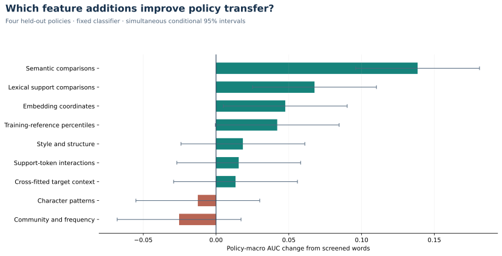

# Jigsaw · Rule-conditioned comment classification

Predict whether a comment violates a supplied community rule, using the rule and examples of permitted and prohibited comments.

**Start with [03 · Results and decision](notebooks/03_saved_results.ipynb), then [02 · Feature research](notebooks/02_baseline_and_review.ipynb).** The first is a short evidence tour; the second explains the completed feature-research phase and its stopping decision. The fitted model now has nested development validation; protected confirmation and product delivery come next.

[](https://github.com/alvaromendizabal/jigsaw-rule-classifier/actions/workflows/quality.yml)

Built by Alvaro Mendizabal. This project combines rule-conditioned NLP, training-only screening, cross-fitted target features, frozen representations, matched ablations and resumable AWS experiments. Its central finding is that **features which work on familiar policies can fail on a new policy**. No leaderboard score, medal or state-of-the-art claim is made.

## What the research found

The expanded study uses **11,135 development rows across four policies** and seven strict comment/support-purged splits. **43,576 rows remain reserved**, including financial-advice and spoiler policies excluded from research. This is a post-competition benchmark built from the host's released data.

| Representation | Held-out policy AUC ↑ | Log loss ↓ | Brier ↓ |
| --- | ---: | ---: | ---: |
| Rule/example lexical reference | 0.4728 | 0.8126 | 0.2992 |
| Words + compact semantic comparisons | 0.5761 | 0.8156 | 0.2969 |
| Compact semantic comparisons alone | 0.6876 | 0.6891 | 0.2456 |
| Frozen semantic centroid | **0.7042** | **0.6237** | **0.2177** |
| All transferable feature families | 0.5515 | 1.4700 | 0.4503 |
| Semantic comparisons + labeled retrieval | 0.5590 | 1.4763 | 0.3613 |
| Plain-document support centroid | 0.6865 | 0.6214 | 0.2170 |
| Fixed centroid/intent average (rejected) | 0.7086 | 0.6549 | 0.2320 |

The centroid's matched development improvement is **+0.2314 AUC**, with a within-study simultaneous 95% interval of **[0.1889, 0.2740]**. Compact semantic features add **+0.1385** to the same screened-word control. These intervals condition on fixed predictions and four observed policies; they do not establish independent generalization.



Most of the centroid's average gain comes from avoiding reversed lexical ranking on illegal-activity promotion. Legal-advice AUC remains **0.5702** and medical-advice AUC **0.5969**. The full feature model reaches **0.7989 on familiar policies**, but only **0.5515 on held-out policies**. Reporting only familiar-policy performance would conceal the project's central failure mode.

## What makes the feature work substantive

- **188,595–188,598 candidate columns per fold**, including 309 retrieval and 77 semantic-formatting/intent candidates; **9,281–9,660 retained** across banks before final family selection. Counts are fold-specific, not independent hypotheses or one promoted model's width.
- **323 fixed fits** in the four-policy campaign: 238 primary comparisons, 22 changed-training sensitivities, 35 retrieval and 28 formatting/intent fits. Six identical sensitivity cases reuse saved fits. Six embedding-resolution scores and one fixed fusion require no additional inference or fitting; three new frozen formatting scores use the separately recorded encoder caches.
- Matched additions/removals, per-policy results, group permutation, coefficient contributions, selection stability and paired uncertainty. Classifier hyperparameters stay fixed.
- Exact body/support isolation; training-only vocabulary, scaling, screening, percentiles, NB and SVD; inner cross-fitting for target context; query-policy exclusion for labeled retrieval.
- Explicit negative results: adding retrieval damages the compact semantic model; no shorter embedding prefix improves the centroid; larger combined banks do not solve transfer. Historical NLI/instruction failures remain documented on their original two-policy cohort.
- Conflict, near-copy and support-dependence sensitivities. Removing all 18 self-support matches leaves centroid AUC **0.7034**. Missing timestamps, authors and threads are treated as unavailable data, not invented features.
- A source-checked 48-row qualitative error audit, completed before new scores, motivates a falsifiable policy-intent comparison. No labels were changed; one assistant's stratified review cannot estimate a population label-error rate.

[Expanded study and results](docs/EXPANDED_STUDY.md) · [Retrieval experiment](docs/RETRIEVAL_STUDY.md) · [Embedding resolution](docs/RESOLUTION_STUDY.md) · [Historical methods and feature provenance](docs/FEATURE_RESEARCH.md).

## Current decision and remaining product work

**Feature research: COMPLETE for the declared four-policy scope.** Retain the original frozen centroid for unseen policies. Seven new semantic candidates and one fixed average fail the predeclared replacement criteria. The average's higher AUC is uncertain, advertising regresses and probability losses worsen. [Stopping evidence](reports/feature_decision/decision.json) · [Coverage and exclusions](docs/FEATURE_COVERAGE.md) · [Semantic results](docs/SEMANTIC_FORMATTING.md).

**Model fitting and development calibration: COMPLETE.** Nine inner fits validate calibration without sharing outer validation labels. Familiar-policy log loss improves from **0.4761 to 0.4689**; transfer calibration worsens log loss to 0.6976 and is rejected. The fitted route uses calibrated familiar-policy features and the raw unseen-policy centroid. Its familiar pipeline retains **9,263 of 181,958 candidate columns**. [Protocol, results and lineage](docs/MODEL_VALIDATION.md).

**Product promotion: PENDING.** A target-blind copy audit leaves **43,509 eligible confirmation rows** after excluding 67 approximate development copies. Their targets remain unopened. The standalone inference notebook still names the original lexical reference; the fitted candidate needs the protected comparison and verified offline integration.

The remaining milestones are finite:

1. **Confirm the fitted model:** freeze the completed candidate/reference artifacts and acceptance criteria, then perform one protected comparison on the 43,509 eligible rows. [Next milestone](docs/FINAL_MODEL_PLAN.md).
2. **Deliver inference:** connect accepted artifacts to offline inference, probability/triage diagnostics and measured latency/memory budgets; add a small example-driven interface.
3. **Release the portfolio product:** an example-driven demonstration, model/data cards, clean-environment restore and a tagged release with a short reviewer path.

[Acceptance criteria and roadmap](docs/ROADMAP.md#next-three-deliverables). The [completion assessment](docs/FEATURE_RESEARCH.md#completion-assessment) is approximately **88% overall**; notebook `02` closes the declared feature phase. This is an effort-weighted planning judgment, not an employer rating or a guarantee of generalization.

## Review or reproduce

The five executed notebooks need no private data, AWS account or model download to read. They render verified public aggregates and Plotly figures with SVG fallbacks.

| Notebook | Question |
| --- | --- |
| [03 · Results](notebooks/03_saved_results.ipynb) | What improved, what failed, and what can we claim? |
| [02 · Feature research](notebooks/02_baseline_and_review.ipynb) | Which families contribute, and how were they screened? |
| [01 · Validation](notebooks/01_data_and_validation.ipynb) | What prevents leakage and misleading validation? |
| [04 · Diagnostics](notebooks/04_semantic_benchmark.ipynb) | Which policies, probability errors and support conditions matter? |
| [00 · Environment](notebooks/00_environment_and_data.ipynb) | Where did the data and artifacts come from? |

```bash
uv sync --locked --extra semantic --group dev
uv run python scripts/verify.py
uv run python scripts/execute_notebooks.py --publish
uv run jigsaw gate
# After restoring private artifacts; no fitting:
uv run python scripts/verify_expanded.py
```

Automated tests, locked dependencies and CI cover software contracts. Private verification checks all 100 expanded/retrieval metric records and 20 new semantic metric records, replays 14 earlier and all 28 new fitted models, and rebuilds all 28 new feature transforms. Source/configuration/data identities, completed-stage hashes and encrypted S3 archives preserve expensive work. Interrupted active stages restart; intact completed work is reused. Neural optimizer-state recovery is not claimed. [Actual quality and execution record](docs/VALIDATION.md).

[START_HERE.md](START_HERE.md) covers restoration and the user's offline submission workflow. [VALIDATION.md](docs/VALIDATION.md) records actual executions, checksums and limits. Public aggregates do not substitute for private OOF verification.

## Metric, provenance and limits

The primary metric is equal-weight **policy-macro ROC AUC**; pooled AUC is separate. The official column-averaged AUC description and [host per-rule release](https://www.kaggle.com/competitions/jigsaw-agile-community-rules/discussion/641121) strongly corroborate this aggregation. Executable scorer parity and a project Kaggle score are not claimed. [Arithmetic audit](reports/released/metric.json) · [Released-data boundary](docs/RELEASED_DATA.md).

[Competition](https://www.kaggle.com/competitions/jigsaw-agile-community-rules/overview) · [Host data release](https://www.kaggle.com/competitions/jigsaw-agile-community-rules/discussion/641107) · [Research and model sources](docs/FEATURE_RESEARCH.md#research-sources-and-external-data-feasibility).

Code: MIT. Data and third-party models retain their own terms. The canonical [Kaggle notebook](kaggle/submission.ipynb) supports the user's own offline CSV generation; this work does not upload or submit predictions automatically.
