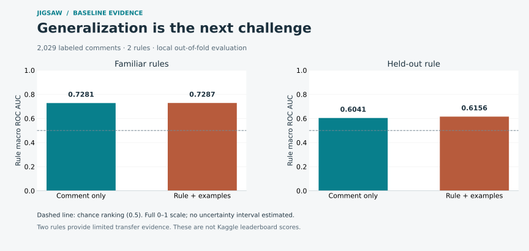

# Jigsaw · Rule-conditioned comment classification

Predict whether a comment violates a supplied community rule, using the rule text and examples of permitted and prohibited comments.

This project studies how text models behave when policies change. It combines explicit validation, auditable probability metrics, resumable experiments, and portable offline inference. Built by Alvaro Mendizabal for an employer-facing NLP portfolio.

**Current milestone:** The real-data CPU baseline is complete and preserved in S3. Next: semantic rule generalization. This repository contains a reproducible reference system, not a state-of-the-art performance claim.

[](https://github.com/alvaromendizabal/jigsaw-rule-classifier/actions/workflows/quality.yml)

## Recorded baseline

Run `c15c2c2318fc0ed619c6` evaluated **2,029 competition training rows**. Each model has one out-of-fold prediction per row in each protocol. Results are local cross-validation, **not leaderboard scores**.

| Model | Familiar-rule macro AUC | Held-out-rule macro AUC | Held-out log loss | Held-out Brier |
| --- | ---: | ---: | ---: | ---: |
| Comment-only TF-IDF | 0.7281 | 0.6041 | 0.6731 | 0.2400 |
| Rule/example TF-IDF | 0.7287 | 0.6156 | 0.6736 | 0.2405 |



Adding lexical example features changes familiar-rule AUC very little and gives a modest descriptive improvement in held-out ranking. Probability losses do not improve. No significance claim is made. Semantic understanding and broader validation are the next research questions.

The audit found 162 duplicate training bodies and overlap between training and all 10 preview test comments. The preview tests submission plumbing; it cannot establish independent model performance. [Inspect the recorded evidence](reports/baseline/README.md) and [the Phase 2 experiment plan](docs/PHASE_2.md).

## Start here

For the existing AWS project, follow [START_HERE.md](START_HERE.md): clone this repository into the persistent workspace, reuse its private configuration, restore the saved snapshot, and review it. Existing Kaggle authentication remains valid.

```bash
bash bootstrap.sh
uv run jigsaw restore
uv run jigsaw review --run-id c15c2c2318fc0ed619c6
```

`review` validates saved checksums and recomputes metrics from saved predictions. It never trains a model. Its exports identify the run, dataset kind, row count, and training file hash. By default it refuses synthetic results. Open **notebooks/03_saved_results.ipynb** for an interactive review.

| Notebook | Purpose |
| --- | --- |
| `00_environment_and_data.ipynb` | Verify environment and data contracts |
| `01_data_and_validation.ipynb` | Inspect labels, duplicates, and validation splits |
| `02_baseline_and_review.ipynb` | Run or resume a baseline under the current source fingerprint |
| `03_saved_results.ipynb` | Review an already completed run without retraining |
| `kaggle/submission.ipynb` | Regenerate an exact-format submission offline |

A new baseline is `uv run jigsaw baseline --cloud`. Rerun that command after an interruption to reuse matching completed stages. A source or environment change deliberately creates a new experiment fingerprint; use `review` to inspect historical runs without recomputing them.

## Evaluation

The official overview names **column-averaged AUC**. Published descriptions of the challenge identify this as averaging rule-specific AUCs. We implement **rule macro ROC AUC**, and separately report **pooled ROC AUC**. The metric tests deliberately use examples where these disagree. The overview does not provide executable scorer code; a future actual Kaggle score is the authoritative external check.

Secondary diagnostics: average precision (AP), log loss, Brier score, equal-width calibration error, confusion matrix, and precision/recall/F1 at 0.5. AP is identified precisely rather than equated with trapezoidal PR AUC. Threshold metrics are diagnostics; threshold selection and calibration fitting are deferred to nested validation.

Two complementary protocols:

- **Seen-rule grouped CV:** stratification by rule and target, grouping normalized duplicate bodies.
- **Held-out-rule CV:** no training rows from the evaluated rule.

Both purge training rows whose body or example fields contain a validation body. Vocabulary is fitted only on retained training rows. Provided validation examples remain legitimate inputs, but their labels are not added to the training set. Near duplicates and shared origins require further audits. Only two labeled rules means only two rule-transfer experiments; it is not broad evidence of generalization.

## Models and phase boundaries

The two initial models are deliberately interpretable CPU references:

1. TF-IDF comment features with logistic regression.
2. The same features plus comment-to-rule/example similarities, positive/negative maximum similarities, and their margin.

The baseline does not establish deep semantic rule understanding. [ROADMAP.md](docs/ROADMAP.md) specifies the embedding, encoder, LoRA, ensemble, calibration, and deployment phases and their acceptance gates.

## Reliability

- Python 3.12, pinned direct packages, complete `uv.lock`, isolated environment.
- UTC timestamps, 15-second heartbeats, per-stage elapsed times and explicit failure events.
- Content fingerprints include data, code, configuration, and modeling library versions.
- Fold outputs commit only after the action succeeds; checkpoints require matching SHA-256 hashes.
- Completed stages survive interruptions. The active CPU fold restarts; it does not resume inside a solver iteration.
- A process lock prevents concurrent baseline runs on the same local project.
- S3 backup uses immutable content objects and publishes its manifest last. A failed backup retains the prior committed snapshot.
- Restore verifies hashes and refuses to overwrite differing local work. Cloud snapshots assume a single writer.
- No arbitrary unpickling during resume. The exported `model.joblib` is for trusted local use only.
- Raw comments, credentials, per-row predictions, and weights are excluded from Git. Only reviewed aggregate evidence is published.

`uv run python scripts/verify.py` runs compilation, Ruff, formatting, pytest, and notebook source-consistency checks. CI also executes all five notebooks in a Jupyter kernel and retains logs and executed synthetic notebooks as downloadable artifacts for 30 days. Source and reviewed evidence remain in Git; experiment artifacts remain in S3. `--engine inprocess` is an explicit option for environments that cannot open Jupyter sockets; it tests cell logic and rich outputs, not kernel integration.

## Kaggle compatibility and competition status

The event ended **October 23, 2025**. Its official page requires notebook submissions, internet disabled, CPU or GPU runtime at most 12 hours, and an output named `submission.csv` containing `row_id,rule_violation`. The standalone notebook trains the reference model and uses the current test file, so it does not assume the preview test size or IDs. It makes no network calls or package installations.

A disabled Late Submission button was visible while signed out on September 7, 2026. Authenticated late-submission eligibility has not been verified. A finished competition cannot award a new competitive medal for this work. Published winning scores are comparison targets, not results attributable to this project.

## Sources

- [Official overview, metric, timeline, and notebook requirements](https://www.kaggle.com/competitions/jigsaw-agile-community-rules/overview)
- [Official data schema and two-rule training limitation](https://www.kaggle.com/competitions/jigsaw-agile-community-rules/data)
- [Competition rules](https://www.kaggle.com/competitions/jigsaw-agile-community-rules/rules)
- [First-place solution index](https://www.kaggle.com/c/jigsaw-agile-community-rules/writeups/1st-place-solution)
- [GigaEvo paper, challenge description and per-rule AUC](https://arxiv.org/pdf/2511.17592)

The data page labels the dataset CC0. Competition terms and third-party model licenses must also be reviewed for later data augmentation, model redistribution, and deployment.

Code license: MIT. Data and third-party models retain their own terms.
