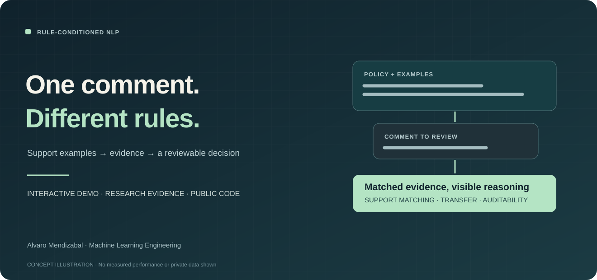

# Jigsaw · Rule-conditioned NLP

**Alvaro Mendizabal · NLP · Evaluation design · AWS ML engineering**

[](https://github.com/alvaromendizabal/jigsaw-rule-classifier/actions/workflows/quality.yml)



I built a system that ranks whether a comment violates a supplied community rule. My work covers support-adapted Qwen models, text-overlap purging, policy-transfer evaluation, multi-backbone research and recoverable AWS execution.

**Recorded late evaluation: 0.91808 public / 0.91425 private ROC AUC**, an absolute **+0.29469 private AUC** improvement over the project's lexical baseline. A separate matched-backbone study isolated the support-adaptation gain; the public demo below illustrates the input and evidence contracts with a lightweight, inspectable method.

**Start here:** [Policy Lens demo](https://alvaro-policy-lens.tartmacaw2.chatgpt.site) · [Case study](CASE_STUDY.md) · [Three-minute review](docs/EMPLOYER_REVIEW_GUIDE.md) · [Run locally](docs/REPRODUCIBILITY.md)

## Try Policy Lens

[Open the public demo](https://alvaro-policy-lens.tartmacaw2.chatgpt.site) without installation. To run the same module-based source locally, serve the checkout:

```bash
python -m http.server 8000
```

Open `http://localhost:8000/public-demo/`. Edit the rule, comment and allowed/violation examples. Compare the same comment across three fictional policies, inspect matching terms and support examples, and export the result.

The browser fits TF–IDF on supplied examples only and computes a contrast between violation and allowed support matches. Exact query/support duplicates are purged; conflicting examples are rejected. Its margin is not a probability. This authored-text demo runs locally without Qwen weights, a backend or account access.

```bash
node tools/test_public_demo.mjs
```

## What I built

| Capability | Evidence |
|---|---|
| Support-adapted neural ranking | Qwen3-4B + LoRA; matched development AUC **0.61460 → 0.71989** |
| Transfer-aware evaluation | Whole-policy holdouts, query/support purging and group-safe uncertainty |
| Controlled model research | Five-backbone development candidate **0.740351** policy-macro AUC; separate from official scores |
| Recoverable execution | Model/data/source identities, optimizer and inference checkpoints, artifact checksums |
| Reviewable decisions | Executed notebooks, aggregate receipts, regression tests and CI |

## Results and interpretation

A 323-fit feature campaign measured **0.7989 familiar-policy AUC versus 0.5515 held-out-policy AUC**. That contrast exposed a transfer problem that a single familiar-policy score would have hidden.

Later teacher-transfer and reciprocal-learning studies did not clear their registered promotion gates. I preserved those negatives and retained the stronger controls. The repeatedly inspected 881-comment/two-policy cohort is development evidence, not an untouched holdout.

[Scored receipt](reports/checkpoints/kaggle_adaptation.json) · [Executed project review](notebooks/31_complete_project_review.ipynb) · [Research decisions](CASE_STUDY.md)

## Run the public Python review

```bash
uv sync --locked --group dev
uv run python scripts/review_portfolio.py --execute
```

This executes the aggregate review and verifies its saved Plotly/SVG outputs. It runs no neural model. [Environment, tests and evidence scope](docs/REPRODUCIBILITY.md)

## Explore the system

[Case study](CASE_STUDY.md) · [Validation notebook](notebooks/01_data_and_validation.ipynb) · [Five-model study](notebooks/29_five_model_frontier_review.ipynb) · [Model card](MODEL_CARD.md) · [Closeout](docs/PROJECT_CLOSEOUT.md)

The public release contains reusable code, authored examples, aggregate receipts and executed notebooks. Raw comments, private predictions, weights, optimizer state, credentials and exact private ensemble construction remain excluded. Historical scores are late evaluations, not a claim of original competition placement or production moderation readiness. [Source credits](docs/TOP_SOLUTION_INTEGRATION.md)
