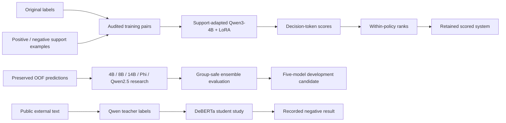

# Jigsaw · Rule-conditioned NLP

**An end-to-end NLP research system for deciding whether a comment violates a supplied community rule — built from lexical baselines through support-adapted Qwen models, transfer-aware validation, AWS multi-backbone ensembles, and controlled supervision research.**

Built by [Alvaro Mendizabal](https://github.com/alvaromendizabal).

**0.91808 public ROC AUC · 0.91425 private ROC AUC · +0.29469 private AUC over the lexical baseline**

[**3-minute project overview**](notebooks/27_latest_system_checkpoint.ipynb) · [**Five-model research**](notebooks/29_five_model_frontier_review.ipynb) · [**Validation design**](notebooks/01_data_and_validation.ipynb) · [Start here](START_HERE.md)

## At a glance

| Area | Evidence |
| --- | --- |
| **Retained scored system** | Support-adapted Qwen3-4B · **0.91808 public / 0.91425 private ROC AUC** |
| **Measured improvement** | **+0.29469 private AUC** over the project’s lexical reference |
| **Development ensemble** | Five-backbone AWS candidate at **0.740351 policy-macro AUC** on the fixed 881-row / two-policy development cohort |
| **Transfer research** | Support adaptation, whole-policy holdouts, group-safe OOF evaluation, multi-backbone diversity, retrieval, ranking, context, and entailment studies |
| **Experiment scale** | 323-fit feature/generalization campaign plus neural studies spanning Qwen3/Qwen2.5, Phi, Llama, ModernBERT/Ettin, and DeBERTa NLI families |
| **Engineering** | AWS SageMaker, GPU benchmarking, resumable checkpoints, immutable data/model identities, executed notebooks, Plotly evidence, GitHub Actions CI |

## The problem

Community moderation is not a fixed toxicity task. The same comment may be acceptable under one policy and violate another. This project ranks comments by whether they violate a **supplied rule**, while using permitted/prohibited examples as context and explicitly testing whether learned behavior transfers beyond familiar policies.

## What I built

**A task-adapted neural ranking system.** The retained path uses Qwen3-4B-Instruct-2507 with LoRA adaptation, supplied support examples, one-position decision loss, forward-only answer scoring, length-sorted inference, restored row order, and within-policy rank normalization.

**A transfer-aware validation framework.** Familiar-policy and whole-policy holdouts are separated, text overlap is purged across train/validation boundaries, model selection uses group-safe evidence, and development results are kept distinct from official scored results.

**A multi-backbone research program.** Qwen3-8B, Qwen3-14B, Phi-4-mini, and Qwen2.5-14B were evaluated for complementary error structure rather than assuming larger standalone models would automatically win. The strongest fixed five-model development candidate improved both observed policies.

**A reproducible AWS experimentation platform.** Training and research run in SageMaker with pinned model revisions, content-addressed artifacts, resumable optimizer/checkpoint state, GPU memory/throughput benchmarks, explicit promotion gates, and structured failure handling.

## System architecture

```mermaid
flowchart LR
    A[Original labels] --> D[Audited training pairs]
    B[Positive / negative support examples] --> D
    D --> E[Support-adapted Qwen3-4B + LoRA]
    E --> F[Decision-token scores]
    F --> G[Within-policy ranks]
    G --> H[Retained scored system]

    I[Preserved OOF predictions] --> J[4B / 8B / 14B / Phi / Qwen2.5 research]
    J --> K[Group-safe ensemble evaluation]
    K --> L[Five-model development candidate]

    M[Public external text] --> N[Qwen teacher labels]
    N --> O[DeBERTa student study]
    O --> P[Recorded negative result]
```

## Selected research evidence

| Study | Result | Decision |
| --- | --- | --- |
| **Support adaptation** | Policy-macro AUC **0.61460 → 0.71989** on the fixed 4B development study | Keep |
| **Qwen3-14B capacity study** | 14B weaker standalone, but useful in a fixed rank blend | Preserve for diversity |
| **Qwen2.5 diversity study** | Five-model candidate reached **0.740351**, **+0.005757** over the prior four-model development reference | Development-promoted |
| **Feature/generalization campaign** | 323 fixed fits; familiar-policy AUC **0.7989** vs held-out-policy AUC **0.5515** | Demonstrated transfer bottleneck |
| **Owned pseudo-supervision** | Six matched fits; best delta only **+0.000193** | Valid negative |
| **10k external-text + DeBERTa study** | External soft labels improved the matched DeBERTa control by **+0.004259**, but the resulting blend did not beat the incumbent | Valid negative |
| **Complementary Llama study** | A support-adapted challenger reached **0.743436** policy-macro AUC vs **0.740351** for the accepted development incumbent, but missed the registered confidence gate | Preserve, not promote |
| **Architecture / context / retrieval frontier** | Pairwise ranking, semantic retrieval, ModernBERT/Ettin context, and NLI variants were tested with matched controls and rejected when they failed promotion gates | Valid negatives |

Negative results are deliberately preserved. A method is promoted only when it clears the registered validation and stability gates; implementation failures are tracked separately from scientific negatives.

## Engineering quality

- **Immutable provenance:** model revisions, source/data fingerprints, checksums, and experiment contracts.
- **Resumability:** checkpoints and completed inference assets are reused instead of recomputed.
- **GPU efficiency:** real-workload batch benchmarks, L4 memory diagnostics, gradient checkpointing, and accumulation when needed.
- **Leakage controls:** query/support separation, whole-policy holdouts, text-overlap purging, frozen prediction gates, and grouped uncertainty.
- **Evidence-first publication:** executed notebooks with saved Plotly/SVG outputs plus machine-readable aggregate checkpoints.
- **CI:** compile, lint, formatting, pytest, notebook execution, checkpoint reuse, offline inference, pinned-encoder verification, and evidence rendering.
- **Public/private boundary:** raw comments, row-level predictions, exact ensemble weights, model/checkpoint state, credentials, and private caches remain outside GitHub.

## Review the work

For the fastest employer review, start with only these three artifacts:

1. [**Project overview · notebook 27**](notebooks/27_latest_system_checkpoint.ipynb) — the retained system, measured improvement, adaptation evidence, and overall project story.
2. [**Five-model frontier · notebook 29**](notebooks/29_five_model_frontier_review.ipynb) — multi-backbone diversity, ensemble validation, and model-selection discipline.
3. [**Validation · notebook 01**](notebooks/01_data_and_validation.ipynb) — leakage controls, whole-policy transfer, and evaluation design.

For deeper research, see [START_HERE.md](START_HERE.md), the [model card](MODEL_CARD.md), the [post-closeout frontier](docs/POST_CLOSEOUT_FRONTIER.md), and the [pseudo-supervision frontier](docs/PSEUDO_SUPERVISION_FRONTIER.md).

## Repository map

| Path | Purpose |
| --- | --- |
| `notebooks/` | Executed employer-facing analysis and review notebooks |
| `src/jigsaw_rules/` | Reusable validation, modeling, metrics, feature, and runtime modules |
| `scripts/` | Training, evaluation, notebook, publication, and verification workflows |
| `configs/` | Compact experiment/model contracts |
| `reports/` | Aggregate evidence, checksummed checkpoints, and saved visual outputs |
| `tests/` | Regression, leakage, reproducibility, notebook, and publication-boundary tests |

## Tech stack

**Python 3.12 · PyTorch · Transformers · PEFT/LoRA · scikit-learn · pandas/NumPy/SciPy · AWS SageMaker · Plotly · Jupyter · GitHub Actions**

## Reproducibility boundary

AWS is the canonical workspace for raw competition data, model weights, optimizer state, row-level predictions, teacher-score arrays, and private operational logs. GitHub publishes the code, compact configs, aggregate evidence, tests, and executed notebooks needed to review the engineering and scientific decisions without exposing private competition artifacts.

[Competition](https://www.kaggle.com/competitions/jigsaw-agile-community-rules) · [Data card](DATA_CARD.md) · [Model card](MODEL_CARD.md) · [Start here](START_HERE.md)
