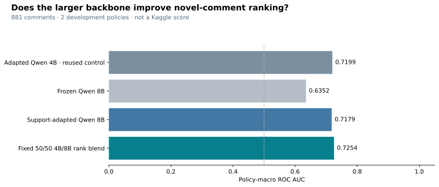

# Competition performance rebuild

The original late entry scored **0.59191 public / 0.61956 private**. Its successful
execution did not meet the performance objective. The target is approximately
**0.92 private AUC**, with no guarantee that a given experiment will achieve it.
The feature and model gates are reopened. The earlier post-competition research
release remains a reproducible historical artifact, not the competition solution.

The owner's [standing execution and research rules](../AGENTS.md) require short,
measurable milestones, explicit resource caps, artifact reuse, leakage-safe
ablations and concrete progress reports. Historical feature-closure documents
describe an earlier, different data scope; they do not close this rebuild.

## What failed

The submitted version used TF-IDF and logistic regression fitted on 2,029 original
training rows. It used eight lexical context statistics and had no semantic
encoder or adaptation to the supplied examples of new policies. The held-out-rule
benchmark already showed weak transfer. A completed notebook and a wide feature
search were insufficient evidence for declaring the performance work complete.

The later accepted model was a separate study using organizer-released labels.
Its 0.7770 protected policy-macro AUC is neither a Kaggle score nor a valid estimate
of the submitted lexical model. Those labels cannot be added to a new entry while
claiming a comparable original-competition result. The consumed protected cohort
will not be used for another tuning cycle.

There is no evidence that a submission-format violation caused the low score:
Kaggle accepted and scored the notebook. The official requirements permit public
external models, require internet-disabled notebook inference, cap CPU/GPU runs at
12 hours, and require `submission.csv`. The original rules specify five submissions
per day; the authenticated late-submission form displayed a limit of 100 on
September 9, 2026. Only one entry is submitted for this candidate.
The competition closed October 23, 2025; new entries are late evaluations.
[Overview](https://www.kaggle.com/competitions/jigsaw-agile-community-rules/overview)
· [Rules](https://www.kaggle.com/competitions/jigsaw-agile-community-rules/rules).

## Methods the first campaign missed

The winner trained on labeled support examples supplied with test policies,
deduplicated without subreddit, adapted language models with a Yes/No-only loss,
and combined predictions using ranks within each policy. His reported 4B Qwen
private result was 0.9198 and the six-model ensemble reached 0.9293. These are the
author's results, not a reproduction by this project.
[First-place write-up](https://www.kaggle.com/competitions/jigsaw-agile-community-rules/writeups/1st-place-solution).

The third-place solution also adapted to supplied examples. It constructed
features from adapted last-token representations and distances to positive and
negative prototypes, then fitted classical classifiers. This motivates testing
learned representations and their interactions, not merely replacing the final
classifier or inflating the count of surface statistics.
[Third-place write-up](https://www.kaggle.com/competitions/jigsaw-agile-community-rules/writeups/3rd-place-solution).

The competition's supplied support labels are legitimate inputs. Hidden body
targets and post-competition released targets are different information. Our
`support_pairs` contract rejects a target column in the inference frame, deduplicates
normalized rule/text pairs, excludes conflicting labels, and purges validation
text from every candidate training source. No assumption turns a violation of one
policy into a negative example for another.

## Bounded experiment: contextual representation features

The first comparison freezes **Qwen3-4B-Instruct-2507**, revision
`cdbee75f17c01a7cc42f958dc650907174af0554`, with verified asset hashes. This model
revision predates the competition deadline. It receives only the 2,029 original
development inputs. No competition targets enter the GPU feature extractor.
[Model card](https://huggingface.co/Qwen/Qwen3-4B-Instruct-2507).

| Feature family | Candidates | Hypothesis and test |
|---|---:|---|
| Rule-only last-token representation | 2,560 | Encode the comment's meaning relative to the written rule |
| Example-only representation | 2,560 | Infer a decision boundary from supplied positive/negative examples |
| Joint rule/example representation | 2,560 | Resolve ambiguous wording using both sources of context |
| Joint-minus-rule residual | 2,560 | Isolate information introduced by supplied examples |
| Joint-minus-example residual | 2,560 | Isolate information introduced by the written rule |
| Rule-by-example coordinate products | 2,560 | Test agreement between the two contextual representations |
| Probability, log odds and answer mass | 9 | Separate ranking signal from confidence that the model follows the task |
| **Unique candidate columns** | **15,369** | Counts are not summed across repeated folds or combined banks |

Every learned bank uses the same logistic classifier, fixed regularization and a
maximum of 64 retained columns. Screens use outer-training labels and statistics
only: constants, rare/duplicate columns, perfect separators, effect ranking and
bounded correlation checks. Ablations compare raw scores, each representation,
context interactions and their combination. Results include policy-macro AUC,
pooled AUC, log loss, Brier score, per-policy scores and paired group bootstrap
intervals. Feature-specific contrasts hold the backbone fixed. Comparing this
experiment against the earlier 0.6B probe does **not** isolate feature engineering.

Both historical validation protocols are retained: three grouped familiar-policy
folds and two held-out-policy folds, with validation comments removed from fitted
training context. Familiar-policy purging leaves only 237–287 training rows per
fold, which must be considered when interpreting learned high-dimensional banks.
The study is exploratory development on previously examined policies, not a new
untouched holdout. A diagnostic excludes 18 rows with self-support overlap.

The cloud worker uses one L4 GPU, a 3,600-second job cap, immutable source/config
identities and hash-verified checkpoints uploaded after every shard. Valid shard
replay does not invoke the encoder. The launch receipt records the exact AWS
image, source version, rate and job. Runtime, completed artifacts and measured
results must be checked before calling the experiment complete.

### Measured result: reject the frozen coordinate bank

The GPU extraction completed 6,087 prompts with zero truncations. The CPU study
completed all 45 fixed feature-bank fits and five lexical-reference fits.

| Original-data held-out policy comparison | Policy-macro AUC |
|---|---:|
| Lexical reference | 0.6156 |
| Frozen 4B rule answer | 0.7081 |
| Frozen 4B joint rule/example answer | 0.7056 |
| Screened rule representation | 0.5508 |
| Screened joint representation | 0.4881 |
| Screened combined feature bank | 0.4516 |

The full bank retains 64 of 15,369 columns in each fold: 15,300 exceed the fixed
screen budget and five are constant or nearly constant. The rule-answer gain over
the lexical reference is +0.0926, with a within-study simultaneous 95% interval
of [0.0476, 0.1376]. Adding supplied examples to the prompt changes AUC by -0.0026
[-0.0476, 0.0424]. This provides no evidence of a useful prompt-context gain.
The learned coordinate bank fails transfer and is rejected.
[Verified aggregates](../reports/competition_features/metadata.json).

A numerical audit found that float32 sigmoid rounded 867 rule-only probabilities
to one, losing ranking information. Reconstructing float64 probabilities from the
saved log odds corrects AUC from 0.6883 to 0.7081 without any new inference. The
recomputed study includes that correction and leaves the full-bank result at
0.4516. Raw probability losses remain poor. These are original-data development
scores, not new Kaggle scores or evidence that the 0.92 objective has been reached.

### Completed controlled comparison: learning from supplied supports

`configs/support_adaptation.json` fixes one epoch of rank-8 LoRA on the same 4B
backbone and the identical rule-only prompt. Only the final Yes/No token contributes
to the loss. The new rule's supplied support pairs occur twice; other legitimate
training pairs occur once. No subreddit is used for deduplication or prompting.

The target-blind novel-comment cohort contains **881 rows**: 234 for one policy
and 647 for the other. All 1,148 rows whose body occurs in any supplied support
pool are excluded from evaluation. Per fold, 1,640/1,215 unambiguous unique training
pairs remain after purging, including 629/366 pairs from the new rule's supplied
supports. Query targets are absent from the cloud input; every query body is
excluded from every fitted source. This tests **support adaptation to a new rule**,
which is a different task from zero-shot held-out-rule validation.

The comparisons hold the model and training inputs fixed: direct log-odds ranking,
screened 2,560-dimensional decision representations, positive/negative centroid
and nearest-example margins, and a fixed 50/25/25 rank blend. Top-five-neighbor
margins are secondary geometry diagnostics. Readout screens use supplied training
labels only. The paired group bootstrap covers five declared contrasts. Neither
the original two-policy cohort nor the consumed post-competition holdout is a new
untouched validation set.

Training checkpoints include adapter weights, optimizer, learning-rate scheduler,
Python/NumPy/Torch/CUDA random state, exact data order, step and source/configuration
identity. A CPU interruption test with nonzero dropout reproduces uninterrupted
adapter weights bit for bit. The bounded GPU job also deliberately reloads a
fresh model after its first durable optimizer checkpoint in each fold. Both GPU
folds resumed from optimizer step 8 and completed their 142/99-step epochs.
All 96 frozen inference
shards were recovered with identical representation hashes and zero model GPU
allocation. The complete 360-test CI run and all five real Jupyter notebook
executions/replays passed.

The completed AWS study took 899.7 worker seconds, with 1,253 billable instance
seconds and 8.31 GiB peak allocated GPU memory. Evaluation and its checksum-verified
replay both passed. This cohort is smaller and harder than the earlier full
2,029-row study; its frozen score must not be compared as if the cohorts matched.

| Same 881 novel comments | Frozen 4B AUC | Support-adapted 4B AUC |
|---|---:|---:|
| Direct decision score | 0.6146 | **0.7199** |
| Screened decision representation | 0.6715 | 0.7174 |
| Class-centroid margin | 0.6434 | 0.7185 |
| Nearest-example margin | 0.6622 | 0.6791 |
| Top-five-example margin (secondary) | 0.7013 | 0.7145 |
| Fixed decision/geometry blend | 0.6499 | 0.7180 |

The direct adaptation gain is **+0.1053 AUC**, simultaneous 95% interval
**[0.0612, 0.1493]**, across the five declared paired contrasts. Advertising
improves from 0.5705 to 0.6793; legal advice improves from 0.6587 to 0.7605.
Adapted coordinates improve their matched frozen readout by +0.0459
[0.0018, 0.0899], but do not beat the adapted direct score. The fixed prototype
blend adds -0.0019 [-0.0460, 0.0421], so its extra complexity is not supported.
Each coordinate screen retains 64 of 2,560 columns and rejects 2,496; four readout
fits cover 5,138 distinct frozen/adapted coordinate and geometry candidates.
Raw decision log loss improves from 4.8858 to 0.7232 and Brier score from 0.3756
to 0.2292, although the probabilities remain imperfectly calibrated.

**Decision:** retain support adaptation for the next competition candidate. Do
not add the screened readout or fixed geometry blend. The two previously examined
development policies do not establish unseen-policy performance or a 0.92 Kaggle
score. The next gate is a verified offline GPU notebook using legitimate support
inputs in the hidden run, followed by one recorded late submission.
[Verified aggregates](../reports/support_adaptation/metadata.json).

## Subsequent acceptance gates

1. **Representation evidence.** Publish retained/rejected counts, matched-family
   AUC changes and failures from the bounded comparison. More coordinates alone
   are not an improvement.
2. **Support adaptation.** Implement supervised representation learning from
   supplied support labels, including a separate evaluation that mimics new-rule
   support availability. Compare the same backbone before and after adaptation.
   Keep query bodies out of fitting for the measured novel-comment cohort.
3. **Adapted geometry.** Compare direct answer scores, adapted decision embeddings,
   positive/negative prototype distances, hard-negative comparisons and a compact
   combined representation. Screen and ablate within training boundaries.
4. **Competition execution.** Fit from legitimate support inputs inside Kaggle's
   offline hidden run. Verify optimizer/scheduler/RNG/data-order recovery, time,
   memory, asset attachment, row order, prediction parity and complete output.
5. **Promotion.** A validated candidate replaces the canonical submission only
   after the measured gains and inference budget support it. Preserve every
   submission receipt. A late score cannot change the completed leaderboard rank.

Temporal, rolling, player/team and opponent features are inapplicable: this
dataset supplies no timestamps or longitudinal entities. Additional public data
requires a documented license, availability date and contamination check.
Research closure requires diminishing returns across plausible semantic feature
families and defensible end-to-end performance; a numerical portfolio rating is
not an acceptance test.

## Offline competition candidate

The canonical `kaggle/submission.ipynb` now contains the support-adapted 4B candidate. `kaggle/reference.ipynb` preserves the original lexical control and its score history. The CPU synthetic/original-preview checks explicitly select that historical control, so a passing CPU check cannot be mistaken for neural verification.

The T4 runtime uses FP16 loss scaling, retries a skipped overflow step without advancing the scheduler or data order, and saves the scaler together with adapter, optimizer, scheduler and RNG state. Two completed optimizer checkpoints are retained. Training and completed prediction caches bind input files, model hashes, runtime versions, configuration and source. The pinned upstream tokenizer configuration and Apache license are embedded because the Kaggle mirror differs in those files; all 11 upstream file hashes must pass before model loading. An incompatible optional `torchao` installation is removed only for the exact observed PEFT/torchao version pair.

An authored-data T4 probe completed two optimizer steps, deliberately reloaded after step one and produced finite predictions. It is a software check, not an AUC measurement. The original-data 117-step preview and saved offline execution are recorded separately in [the runtime receipt](../reports/checkpoints/kaggle_adaptation.json). A ten-row preview cannot establish a new competition score.

The expanded local suite passes 371 tests, including exact interrupted-training recovery, overflow retry, cache corruption, novel-policy support eligibility, extreme-score ranking and generated notebook/source parity. Five public notebooks were executed with the in-process runner; GitHub CI additionally requires real Jupyter execution and replay. The offline execution gate has passed; broader representation research and the 0.92–0.93 objective remain open.

The original-data T4 preview completed all **117 optimizer steps** in **612.3 worker seconds**, used **8.26 GiB** peak allocated GPU memory, and validated all **10 preview rows**. Canonical notebook replay reused the completed result with identical CSV hash and no model fitting. The fresh offline saved Version 3 (**348640051**) independently completed its 117-step epoch at **23:45:38 UTC on September 9, 2026**, taking **603.5 worker seconds / 8.26 GiB** and producing the same CSV hash. The saved manifest's six runtime source hashes, model assets and configuration match the canonical repository. Saved outputs contain the checkpoints, runtime, validated CSV and manifest; row order, schema and finite ranks passed inspection. The notebook remains private.

GitHub Quality run **34417662301** passed at evidence commit `62464de`, including all 371 tests, five actual Jupyter notebooks and replay, the historical CPU control and the pinned semantic encoder. The submitted implementation remains `a493697`.

## Verified hidden Kaggle evaluation

Version 3 / **348640051**, implementation **a4936977c945110ea5b86398cdfb9d2a9f12556b**, was submitted once and remains private. At **2026-09-10 02:20:43 UTC**, both the authenticated account row and Submission Details reported **Succeeded (after deadline)** and these actual scores:

| Kaggle entry | Public AUC | Private AUC |
|---|---:|---:|
| Original lexical Version 2 | 0.59191 | 0.61956 |
| Support-adapted Qwen3-4B Version 3 | **0.91808** | **0.91425** |
| Absolute improvement | +0.32617 | +0.29469 |

Private AUC is **0.00575 below 0.92** and **0.01575 below 0.93**. Public AUC is 0.00192 / 0.01192 below those targets. This is a material end-to-end improvement; it changes the backbone and training method together. The matched 881-row development study, not this two-model comparison, isolates the adaptation effect. Neither a leaderboard rank nor a medal is claimed for this late entry.

The entry was last observed running at 02:13:01 UTC and first observed scored at 02:20:43 UTC. Exact completion time and hidden worker duration are not exposed. Kaggle acceptance verifies that a scoreable hidden output was produced; hidden row count, prediction hash, optimizer steps and GPU measurements were not available for independent inspection. The 603.5-second / 8.26-GiB / ten-row measurements belong to the separately verified saved preview. Do not present those as full hidden-run measurements. No hidden raw predictions or released targets were downloaded or added to Git.

The saved source fits only original training labels and supplied positive/negative support labels. Eleven pinned model assets and the six runtime sources were checked before submission, and the saved preview passed schema, order, finite-rank and exact-replay checks. Successful hidden scoring does not authorize any reuse of organizer-released targets or the consumed protected cohort. PR #19 merged after final-head Quality run 34418699358 passed; the scored notebook remains the original immutable Version 3.

[Exact saved version](https://www.kaggle.com/code/alvaromendizabal/jigsaw-support-adapted-rule-classifier?scriptVersionId=348640051) · [Account result](https://www.kaggle.com/competitions/jigsaw-agile-community-rules/submissions) · [Machine-readable receipt](../reports/checkpoints/kaggle_adaptation.json).

## Highest-value remaining representation experiment

The proposed complementary-model comparison has now been executed with Phi-4-mini,
followed by Qwen3-8B. Both fixed blends fail their registered uncertainty gates;
the measured outcomes are below. The current canonical 4B candidate remains the
scored reference. More model parameters or more ensemble members are not accepted
without measured added value.

The next highest-value representation hypothesis is **explicit support-context
conditioning with the retained 4B adapters**: compare the existing rule/body-only
decision with a fixed, query-purged positive/negative support pair in the native
decision prompt. This changes the model's joint attention to examples and the
query, unlike the already rejected downstream centroid and geometry readouts.
Reuse the saved adapters; freeze the support retrieval rule, order and comparison
before inference, and keep every query body out of the support and fitted pools.
This hypothesis has not been run or shown to improve AUC. Continued comparisons
on two repeatedly examined rules remain exploratory; stronger confirmation needs
independent eligible policy coverage. Do not search blend weights against the
private Kaggle score, access released targets, or reuse the consumed protected
cohort.

The evaluated-candidate milestone is complete. The **0.92–0.93 performance objective and broader representation research remain open**.

Publication validation initially hit a non-JSON NumPy array in the new Plotly display and then a full local workspace during pytest. The display now serializes through Plotly JSON; pruning disposable package caches recovered disk space. These were report-publication failures, not Kaggle model failures. All five updated public notebooks executed and their completed outputs replayed.

### Registered comparison: Phi-4-mini and fixed Qwen blend

The next authorized experiment pins **microsoft/Phi-4-mini-instruct** revision
`5a149550068a1eb93398160d8953f5f56c3603e9` (May 1, 2025), with eleven upstream
asset checksums and the MIT license. This is a distinct 3.8B model family that the
winner also used in an early small-model ensemble. The verified winning private
leaderboard score is **0.92930**; the current measured gap is **0.01505**.
[Pinned model](https://huggingface.co/microsoft/Phi-4-mini-instruct/tree/5a149550068a1eb93398160d8953f5f56c3603e9)
· [Private leaderboard](https://www.kaggle.com/competitions/jigsaw-agile-community-rules/leaderboard).

Reuse the exact completed Qwen study's two folds, 881 novel queries and saved
predictions, identified by the plan and artifact SHA256 values in
`configs/complementarity.json`. Only Phi is newly trained. Its native chat template,
tokenizer and fused attention/MLP projections differ from Qwen; these are declared
architecture changes, not a controlled tokenizer ablation. Other training choices
remain one epoch, rank-8/alpha-16 LoRA, effective batch 16, learning rate 1e-4, seed
2025, BF16 and the same purged original/support training pairs. Phi's decision-token
IDs are No=3160 and Yes=13022. No query targets enter the cloud plan.

The primary candidate is the **fixed 50/50 within-policy rank blend** of Qwen and
adapted Phi log odds. Compare it with Qwen; use frozen-versus-adapted Phi as the
adaptation control. Both contrasts enter one 1,000-draw comment-group bootstrap
with simultaneous intervals. No blend weights are fitted or searched. Promotion
requires positive macro-AUC gain, a simultaneous lower interval above zero, and
no observed per-policy AUC regression. Prediction rank correlation and runtime
measure diversity and its cost. A passing development gate permits a new offline
Kaggle candidate; it does not establish a leaderboard improvement.

One `ml.g6.xlarge` L4 job in the existing project account has a 3,600-second runtime
cap and a 3,000-second worker budget. Verified training price is $1.127/hour in
us-west-2 (up to $1.127 compute at the cap, plus storage). Native CUDA/PyTorch stay
pinned to the proven image. Per-shard feature hashes, transactional optimizer
checkpoints, UTC heartbeats and a real stop/reload recovery probe preserve progress.
See [durable experiment state](../reports/checkpoints/complementarity.json).


### Measured result: Phi adds an uncertain, small blend gain

The registered GPU study completed on September 10, 2026. Both folds performed
all 142/99 optimizer steps, resumed from their real step-8 checkpoints and produced
all 881 finite, ordered query predictions. The worker took **730.0 seconds** and
peaked at **7.84 GiB** allocated GPU memory. SageMaker billed **972 seconds**,
approximately **$0.30429 compute**, plus storage. The completed CPU evaluation
replayed its eight checksummed outputs without model execution or refitting.

| Representation | Policy-macro AUC | Advertising AUC | Legal-advice AUC |
|---|---:|---:|---:|
| Adapted Qwen3-4B, reused reference | 0.71989 | 0.67925 | 0.76053 |
| Frozen Phi-4-mini | 0.60373 | 0.55757 | 0.64988 |
| Adapted Phi-4-mini | 0.70797 | 0.66832 | 0.74761 |
| Fixed 50/50 Qwen/Phi rank blend | 0.72354 | 0.68321 | 0.76388 |

The blend improves macro AUC by only **0.00365**. Its paired 95% interval is
**[-0.00856, 0.01701]** and the preregistered simultaneous interval is
**[-0.03691, 0.04422]**. Both include zero. Both policies improve slightly, but the
confidence gate fails, so **do not promote this blend or submit it to Kaggle**.
Support learning itself improves Phi by 0.10424, with simultaneous interval
[0.06367, 0.14481]; the adapted Phi model still underperforms adapted Qwen.

Prediction Spearman correlations are 0.80556 and 0.84401 across the two policies.
This is evidence of some diversity, with insufficient measured added value for
promotion. No blend weights are tuned after seeing these results. These remain
exploratory development findings on two previously examined rules, not hidden
competition scores or a newly untouched holdout.

The existing **0.91425 private Kaggle AUC** remains the scored reference, **0.01505**
below the winning 0.92930. The next representation test is a fixed **Qwen3-8B
capacity comparison**, reusing the same 4B predictions and eligible plan. It must
be registered separately and pass its own development and offline runtime gates.

Reproduce the aggregate export from the private completed evaluation with
`scripts/publish_complementarity.py`, then render `scripts/build_complementarity_report.py`.
Private prediction arrays and optimizer states remain in the approved S3 project
prefix; only the seven aggregate JSON records and verified figures are published.
[Decision](../reports/complementarity/decision.json) · [Receipt](../reports/checkpoints/complementarity.json).

Private CPU evaluation recovery: `experiments/complementary-support-20260910/evaluation/812dcc2d3672596eda55/evaluation.tar.gz` in the existing project bucket; SHA256 `e9b4048e399f6538c88318effcbd31454b652decd3cf8916269fd01cfbd35ec2`.

### Registered comparison: larger Qwen backbone

The Phi blend's uncertain gain motivates a **Qwen3-8B** comparison, revision
`b968826d9c46dd6066d109eabc6255188de91218` (July 26, 2025), with thirteen verified
upstream asset hashes and Apache 2.0 licensing. The model has 8,190,735,360 parameters;
BF16 weights alone occupy 15.26 GiB. A single L4 will run the development study.
The native template is called with `enable_thinking=False` for a direct decision.
[Exact upstream revision](https://huggingface.co/Qwen/Qwen3-8B/tree/b968826d9c46dd6066d109eabc6255188de91218).

The original 881-row novel-comment plan and saved Qwen3-4B predictions remain fixed.
Train one LoRA epoch with the original rank, learning rate, seed, supplied-support
weighting and effective batch of 16. Micro-batch size is two to fit the larger
model. This comparison changes model size, vintage and native formatting; it
cannot isolate parameter count as a causal effect. Original/support labels remain
the only training sources, with query bodies purged and query labels excluded
from the cloud plan. No released targets or consumed protected cohort is opened.

Two candidates are declared before execution: the adapted 8B direct score and a
fixed 50/50 within-policy rank blend with the 4B reference. Both candidate/reference
contrasts enter a single 1,000-draw group bootstrap with simultaneous intervals.
Frozen 8B scores provide a descriptive control and cannot be selected. Each
candidate must improve macro AUC, have a positive simultaneous lower bound and
avoid a per-policy regression. Choose the highest macro AUC among eligible
candidates; exact ties prefer the single 8B model. There is no weight or training
hyperparameter search. These gates establish development eligibility only.

The additional job uses the existing L4 image and S3 project area, a 3,600-second
job cap and 3,000-second worker cap, at the verified $1.127/hour training rate.
All optimizer/shard states remain hash-checked and resumable. A candidate that
passes must separately demonstrate offline inference on Kaggle's available GPUs
before a new hidden evaluation. A larger model is not presumed to fit one T4.
[Protocol](../configs/backbone_capacity.json) · [Recovery state](../reports/checkpoints/backbone_capacity.json).

### Measured result: the larger model does not establish a useful improvement

The registered 8B job completed at **2026-09-10 04:48:19 UTC**. It performed all
**142/99 optimizer steps**, recovered both real step-8 checkpoints and produced
all **881 finite, ordered query predictions**. The worker took **1,851.3 seconds**;
SageMaker billed **2,211 seconds**, approximately **$0.69217 compute**, plus storage.
Peak L4 allocation was **16.00 GiB**. All thirteen pinned model assets and ten
worker source files passed checksum verification. The private evaluation replay
reused all eight completed outputs without training or inference.

| Representation | Policy-macro AUC | Advertising AUC | Legal-advice AUC |
|---|---:|---:|---:|
| Adapted Qwen3-4B, reused reference | 0.71989 | 0.67925 | 0.76053 |
| Frozen Qwen3-8B, descriptive control | 0.63516 | 0.58511 | 0.68520 |
| Adapted Qwen3-8B | 0.71794 | 0.68280 | 0.75308 |
| Fixed 50/50 4B/8B rank blend | 0.72540 | 0.68754 | 0.76325 |

The direct 8B model loses **0.00195 macro AUC** and **0.00745 legal-advice AUC**.
Its simultaneous gain interval is **[-0.02070, 0.01679]**. The blend adds
**0.00550 macro AUC** and improves both observed policies, but its paired interval
**[-0.00433, 0.01538]** and simultaneous interval **[-0.01325, 0.02425]** both include
zero. Prediction Spearman correlations with 4B are **0.90366 / 0.89311**.
Neither registered candidate passes every gate, so **neither is promoted or
submitted to Kaggle**. The fixed weights and thresholds remain unchanged.

These negative findings limit this specific one-epoch adaptation and fixed blend
on two development rules. They do not prove that larger models cannot help other
policies. The actual scored reference stays **0.91808 public / 0.91425 private**,
with **0.01505** still needed to match the winning private **0.92930**. No new
competition score or leaderboard improvement is claimed.



Export the seven aggregate records with `scripts/publish_complementarity.py
--study backbone_capacity`; render their Plotly/SVG comparison with
`scripts/build_complementarity_report.py --study backbone_capacity`.
Private prediction arrays and optimizer states stay in the approved S3 project
prefix. [Decision](../reports/backbone_capacity/decision.json) ·
[Exact evaluation provenance](../reports/backbone_capacity/metadata.json).

### Independent two-T4 runtime proof

The separate private **Jigsaw - 8B Two-GPU Recovery Probe**, Version 1 /
**348683165**, succeeded in **206.1 Kaggle run seconds**. It used **eight authored
comments only**, no competition data, and Internet was disabled. All thirteen
upstream asset hashes passed. Layers 0–17 and the input embedding ran on GPU 0;
layers 18–35, final norm and output head ran on GPU 1. Two FP16 optimizer steps
completed with a deliberate model reload and optimizer/RNG/scaler recovery at
step 1. Inference returned finite scores. Peak allocations were **7.89102 / 7.88962
GiB** on the two T4s. This establishes small-run sharded execution, not full
hidden-run time, generalization or calibrated probabilities.

The executed source is **c9606e5c5387813d0105667e4111af9428904163**; its exact-head
Quality run **34437570935** passed. The saved runtime manifest binds the model,
configuration, eleven embedded source/asset hashes, device map and installed
package versions. The rendered receipt's canonical JSON hash matches its saved
completion hash. The model used Torch 2.10.0+cu128, Transformers 5.0.0, PEFT 0.19.1
and Accelerate 1.13.0. The previously diagnosed incompatible optional torchao
package was removed using the exact version guard. The completed saved outputs
remain private and no duplicate probe or competition submission is launched.

Probe setup encountered a transient browser timeout and a zero-byte file import;
the import was recovered using the immutable GitHub notebook URL after verifying
remote/local byte equality. A later optional notebook-download event timed out;
the verified rendered logs and durable Kaggle outputs preserve the runtime proof.
Neither issue affected the independent AWS study or its fixed predictions.
[Saved probe](https://www.kaggle.com/code/alvaromendizabal/jigsaw-8b-two-gpu-recovery-probe?scriptVersionId=348683165)
· [Probe source](../kaggle/capacity_probe.ipynb).

### Bounded next step: retained 4B with retrieved support context

The user requested shorter, manageable work and explicitly selected direct
positive/negative support prompting. This step freezes **one candidate**, reuses
the completed 4B adapters and the existing 881-query original-data plan, and
performs **zero optimizer steps**. There are no external LLM labeling/inference
calls, prompt sweeps, blend searches, automatic retries or follow-on jobs.

Fit character 3–5-gram TF-IDF retrieval on each fold's eligible same-rule support
pool only. Select the highest-cosine violating and permitted example separately;
normalized-text ordering breaks ties. All query bodies remain excluded from all
fitted/support sources. Keep the original native system message, Yes/No scoring,
384/96/192-token body/rule/support budgets and head/tail truncation. Add one
violating and one permitted example to the decision JSON. This tests joint
attention to actual examples while holding the trained representation fixed.

Before candidate inference, restore each hash-pinned final adapter and reproduce
the first eight saved rule-only margins within `1e-5`. A failed parity check stops
the job. Prediction batches are checksummed, uploaded before their completion
markers and replayed with model inference disabled. The worker cap is **900
seconds**, with a **1,200-second SageMaker runtime cap** on one `ml.g6.xlarge`.
At the last verified $1.127/hour rate, the runtime cap corresponds to about
**$0.376 compute**, plus storage; this does not estimate ChatGPT Work credits.

Compare the single candidate against the frozen 4B predictions using policy-macro
AUC, per-policy AUC and 1,000 paired group bootstrap draws. Eligibility requires
a positive macro gain, a positive 95% simultaneous lower bound and no policy
regression. The development cohort has already been examined; this is exploratory
evidence, not an independent holdout or a Kaggle score. No released target member
or consumed protected cohort is opened. Only the byte-identical original
`train.csv` member is restored for CPU evaluation.

This bounded step ends after the comparison and a durable draft PR. Notebook
publication, offline candidate validation and any new hidden submission are
separate milestones. The current 4B Kaggle result remains 0.91425 private AUC;
the 0.01505 gap to 0.92930 is unclosed until measured otherwise.

We are not restricted to 4B. The completed 8B study failed its promotion gate;
it does not rule out other models. At 16-bit precision, 9B and 27B weights alone
need roughly 18 GB and 54 GB, before activations and runtime overhead. A 27B
candidate therefore needs more GPU memory or separately verified quantization.
Model family, revision, training and rule understanding matter alongside size.
Direct support context is the next selected hypothesis, not a guaranteed way to
close the entire gap. [Frozen protocol](../configs/support_context.json).

**Execution attempt, September 10:** implementation commit
`455743f38b86414bfc2e4f654ec8769d9d92d273` passed Quality run **34510983016**,
including all five actual Jupyter notebook executions and replay. The recovered
plan exactly matches reconstruction from the original 2,029 training rows; all
881 balanced support selections are valid. Saved baseline predictions reproduce
0.7198933967 policy-macro AUC without inference or fitting.

One job, `jigsaw-support-context-20260910`, was requested at **17:56:33 UTC**.
AWS reported `Training job waiting for capacity` and no training start. After
the five-minute queue allowance elapsed, a stop was requested at **18:02:08 UTC**
(about 335 seconds including checks and API latency). No automatic replacement
job was launched. The stopping/terminal state is recorded in the
[durable attempt receipt](../reports/checkpoints/support_context.json).
The hash-pinned source and retained adapters remain recoverable. **There is no
new GPU prediction or AUC result from this attempt.** The candidate has not been
scientifically accepted or rejected, and the Kaggle gap is unchanged. This draft
stops at the resource blocker instead of escalating into an open-ended run.

### Capacity diagnosis and changed recovery attempt

On September 10 at 18:21–18:23 UTC, AWS verified the first job was stopped and
there were no active training jobs in `us-west-2`. Both `ml.g6.xlarge` and
`ml.g6.2xlarge` have a training quota of one. The observed blocker was the
requested instance's capacity queue; no evidence indicates a model failure or
an exhausted active-training quota. Capacity availability itself cannot be
guaranteed by a quota check.

The single changed attempt uses **one `ml.g6.2xlarge`**, retaining the same L4 GPU,
pinned image, source archive, adapters, prompts, data, precision, parity threshold
and scientific decision rule. Only host CPU/RAM allocation changes. The AWS
Pricing API reports **$1.222/hour** for Oregon training, effective September 1,
2026: the 1,200-second runtime cap is approximately **$0.4073 compute**, plus
storage. Keep the 900-second worker cap and five-minute queue allowance. If this
instance also queues beyond the allowance or the smoke gate fails, stop and
preserve the diagnosis; do not launch a third job in this milestone.

**Recovery outcome:** `jigsaw-support-context-l4-2xl-20260910` was requested at
**18:24:31 UTC** and also remained `Pending / Training job waiting for capacity`.
A stop was requested at **18:29:45 UTC**, about 313.5 seconds after the request
including API/check latency. No training start or billable training time was
reported; this is not a verified dollar charge of zero. No inference or candidate
AUC was produced, and no third job was launched. The exact request, price,
quota diagnosis, stop and terminal state are retained in the existing checkpoint.
The frozen candidate remains scientifically untested. A future milestone needs
a bounded GPU-availability and retained-checkpoint parity check before spending
on candidate inference; repeating these capacity queues is not useful evidence.

### Current representation coverage and next evidence

[Dr.ICL (Luo et al., 2023)](https://arxiv.org/abs/2305.14128) reports benefits from
retrieved demonstrations even for instruction-tuned models, including simple
lexical retrieval. This motivates the context-only ablation; it does not establish
that our character retrieval or Jigsaw model will improve. The domain mechanism
is policy-specific adjudication: examples can clarify intent and exceptions that
the rule alone leaves ambiguous. Retrieval must compare both classes under the
same policy, with query texts excluded. Missing thread context cannot be invented.

| High-value family | Current evidence / remaining question |
| --- | --- |
| Supplied-support adaptation | Matched 4B development gain and actual 0.91425 private Kaggle score; retained |
| Retrieved positive/negative prompt context | Implemented and tested; this single inference ablation supplies the missing result |
| Adapted coordinates and prototype contrasts | Completed original-data ablations did not improve direct answer scores; preserve rejections |
| Rule-conditioned intent, negation, quotation and exceptions | Plausible semantic gaps; historical small-model/lexical tests do not exhaust the adapted representation |
| Semantic or task-trained support selection | Distinct from lexical selection; consider a fixed comparison only after diagnosing the present result |
| Model diversity and fixed rank ensembles | Phi and 8B comparisons failed promotion gates; size alone is not a demonstrated gain |
| Public external policy examples / context | Requires license, pre-deadline availability, relevance and contamination review before use |

The **0.01505** private-score gap remains unallocated: current evidence cannot
separate its causes into feature, model and ensemble contributions. These are
open hypotheses, not a promise that any one family closes the gap. Broader
research proceeds through bounded experiments, not an immediate model sweep.

The label-free selection audit covers all **881** queries. Advertising selects
112 distinct positive and 116 distinct negative examples; legal advice selects
184 and 135. The most frequently reused example serves at most **5.13%** of its
policy's queries. Thus retrieval has not collapsed to one default pair. This is
a diversity diagnostic, not proof of relevance or an AUC improvement. Both
selection hashes are saved in the [audit](../reports/checkpoints/support_context_selection.json).
Reproduce using the approved private plan; no query targets or model calls are
needed:

```bash
python -m scripts.audit_support_context \
  --plan runs/support_context/recovery/plan.json \
  --output reports/checkpoints/support_context_selection.json
```

### A10G recovery milestone, September 10

Current-head Quality run **34514830318** passed for `7c7e79b`. The selected
support-context hypothesis, worker archive, adapters, BF16 precision and `1e-5`
parity gate remain unchanged. The prior successful Phi and 8B jobs obtained
instances in **53.260** and **57.603 seconds** respectively; their subsequent
image-download time is separate. The five-minute capacity allowance is therefore
not based on mistaking image download for a capacity queue.

The one changed route uses `ml.g5.4xlarge` with an A10G GPU. AWS verified a
training quota of one and an Oregon training rate of **$2.030/hour**, effective
September 1, 2026. The same 1,200-second runtime cap implies approximately
**$0.6767 compute**, plus storage. Quota confirms permission to request an
instance, not availability. No optimizer steps or alternate model are planned.

An added inline hardware diagnostic initially exceeded SageMaker's 256-character
container-argument limit. AWS rejected that request before creating a job. The
correction restored the exact previously accepted entrypoint; the existing
checkpoint-parity smoke gate remains intact. The request was then accepted as
`jigsaw-support-context-a10-20260910` at **18:39:28 UTC**, but it remained waiting
for capacity. A stop was requested at **18:44:32 UTC**, after 302.4 seconds.
AWS verified terminal **Stopped at 18:45:23 UTC**. No training start, billable
training time or candidate predictions were reported.
This does not establish a zero-dollar invoice or a negative scientific result.

Separately, the local execution connection failed and both connection paths
reported `409 environment_offline`. The existing immutable S3 bundle and
adapters allowed a controlled remote attempt without rebuilding or exposing
private data. The attempt receipt is durable under the approved experiment
prefix. CPU evaluation and local Git synchronization are blocked by this
workspace outage; no new AUC, notebook execution, model promotion or merge is
claimed. This metadata-only draft update is verified by reading its bytes back
from GitHub. Local tree reconciliation remains required before merge.

The experiment is still untested. Repeated capacity requests across the three
attempts have produced no model evidence. Restore a working execution workspace
and establish an allocatable GPU route before another inference attempt. Keep
all trained checkpoints, the frozen candidate and its decision thresholds; do
not interpret this infrastructure stop as exhausting support-context features.
