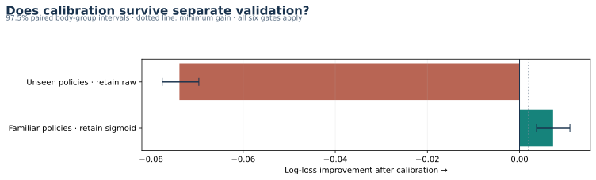

# From validated features to a final model

This protocol follows the closed [feature gate](FEATURE_COVERAGE.md). It is committed before new calibration fits or scores. The previous feature results motivate one fixed route, with no classifier, encoder or feature-family search.

## Candidate and boundaries

Use the existing `all_transfer` model when the normalized supplied policy is present in the fitted training partition. Use the original frozen centroid otherwise. The familiar model uses words, characters, structure, lexical comparisons, support-token interactions, semantic scalars and training-reference percentiles. **It contains no target encodings, community categories or raw embedding coordinates.** Earlier generic planning mentioned cross-fitting target features if present; the selected representation does not contain them.

Policy membership must be computed separately for every training fold. Unseen-policy predictions bypass the familiar feature pipeline. Transform accepts only target-free inference inputs and frozen vectors with the exact model/input contract. Rebuild the selected feature transformations from saved vocabulary, screens, scaling and rank distributions; verify parity with all three saved familiar-policy models before fitting a new one.

## Calibration needs its own validation layer

The only challenger is a two-parameter positive-slope sigmoid on clipped probability logits. Bounds, weak regularization, optimizer tolerance and selection thresholds are fixed in [the machine-readable protocol](../configs/model_validation.json). An identity mapping remains the fallback. No policy-specific unseen-policy calibrator is fitted.

For familiar policies, reuse the three original outer splits and their verified fitted models. Within each outer training partition, create three new stratified normalized-body-group splits and purge inner validation bodies from every training body/support field. Refit the complete selected feature pipeline inside each inner training partition. Fit the outer calibrator only on these inner OOF predictions and labels. Apply it to the saved outer model's predictions on the untouched outer validation partition. Nine inner classifier fits are required; the three completed outer fits are reused.

Simply splitting the pooled original OOF predictions into calibration folds is insufficient: models producing other folds' predictions may have learned from the current validation labels. The nested construction removes that path. For the label-free frozen centroid, calibration can directly use scores and labels from each purged outer training partition, with its held-out policy excluded.

Report raw versus calibrated AUC, log loss, Brier and per-policy results, together with paired normalized-body bootstrap intervals for log-loss improvement. The 97.5% two-sided intervals conservatively account for the two route-specific decisions. Retain calibration only if all predeclared probability-quality and ranking tolerances pass. These remain development decisions, conditional on four observed policies and earlier adaptive feature selection.

The use of held-out predictions for calibration and a final estimator fitted on all development data follows the general [cross-validated calibration design](https://scikit-learn.org/stable/modules/generated/sklearn.calibration.CalibratedClassifierCV.html). The nested outer evaluation is an additional boundary. [Guo et al. (2017)](https://proceedings.mlr.press/v70/guo17a.html) motivates simple post-hoc calibration; it does not establish that calibration will transfer to new community policies.

## Final artifacts and subsequent confirmation

After the development decision, fit one familiar pipeline and one lexical reference on all 11,135 development rows. Fit any retained familiar calibrator on the original familiar-policy OOF scores; fit any retained centroid calibrator on its label-free development scores. Bind feature family order, selected columns, model coefficients, normalized policy set, encoder revision/input format, calibration and training IDs into the inference manifest. Full-development fitting can change selected columns; save the actual final catalog and widths rather than copying fold counts.

The 43,576 reserved targets stay unopened throughout this stage. A separate confirmation protocol must bind the completed artifacts, target-blind eligibility audit, candidate/reference, metrics, uncertainty and acceptance thresholds before target access. A rejected confirmation must be preserved. Product promotion, an offline package and a demo remain subsequent gates.

## Executed development result

Run `a971cf3bc6add1c2d818` completed in 294.5 seconds on 2026-09-09. It reused the frozen 11,973-input embedding cache without new encoding, rebuilt and checked all three familiar outer models, and ran nine purged inner fits plus two full-development fits. Inner training partitions contain 1,440–1,837 rows; this reduction is a consequence of the strict body/support purge. The restored outer probabilities agree with research predictions within 1.12e-16. All four unseen-route checks exactly reproduce the centroid.

| Route | Mapping | Policy-macro AUC | Log loss | Brier | Decision |
| --- | --- | ---: | ---: | ---: | --- |
| Familiar | Raw seven-family model | 0.798916 | 0.476132 | 0.156931 | Parent control |
| Familiar | Nested sigmoid | 0.799093 | 0.468853 | 0.154957 | Retain; 6/6 checks pass |
| Unseen | Raw frozen centroid | 0.704202 | 0.623748 | 0.217725 | Retain |
| Unseen | Held-out-policy sigmoid | 0.704202 | 0.697580 | 0.247946 | Reject; 4/6 checks fail |

The familiar route's paired log-loss improvement is 0.007279, with a 97.5% interval [0.003693, 0.010937]. For unseen policies it is −0.073832 [−0.077567, −0.069619]. Cross-policy calibration can fail while within-policy ranking stays unchanged. Different outer calibrators also slightly change pooled familiar-policy AUC; that is not new feature-engineering gain.

The final familiar classifier fits all **11,135 development rows**, screening **181,958 columns down to 9,263**: 4,096 words, 4,096 character features, 128 structure features, 64 lexical comparisons, 784 support-token products, 31 semantic scalars and 64 training-reference percentiles. These are the actual final columns, separate from the larger research-campaign counts. Candidate SHA-256: `a38b20e1f34ff6d508bc70ba360ceb5f1a646a4f37cac4ebdcb56feebb20d698`. Lexical reference SHA-256: `daca334877cc5958581d7d79a3f4cebcc6dadef4bc26acedbec26430e348eaa0`.

The final familiar sigmoid is fitted to original development OOF scores: slope 0.774128, intercept −0.016586. The unseen mapping is identity. No full-development training score is reported as evaluation. [Aggregate results](../reports/model_validation/results.json), [acceptance checks](../reports/model_validation/calibration.json) and [source/configuration/cache lineage](../reports/model_validation/metadata.json) are public; row-level predictions, selected catalogs and serialized artifacts remain private checkpoints.

## Target-blind confirmation preparation

A separate audit applies the existing fixed near-copy detector before predictions or target access: character cosine ≥0.95, token Jaccard ≥0.90, minimum length 40. It compares reserved bodies against every development body and supplied example. It removes **67 rows representing 42 distinct approximate-copy bodies**, leaving **43,509 eligible rows**. There are no exact development-body/support overlaps and no eligible self-support matches. The detector cannot establish complete paraphrase or conversation-origin independence.

Eligibility run: `60ba8e0ede00928c0943`; ordered eligible-ID hash: `dc37bb6480b75844de3dd2961a55f14a573494913517ae5a6d10a7d6bf8518b0`. The retained rows cover 6,285 advertising, 9,032 financial advice, 6,376 legal advice, 6,425 medical advice, 6,399 illegal promotion and 8,992 spoiler examples. [Audit](../reports/confirmation_inputs/audit.json).

The candidate/reference and eligibility artifacts are ready to bind into the final acceptance protocol. **No reserved target or reserved prediction was used in this milestone.** This model is fitted and validated on development; it has not earned promotion to the canonical offline submission notebook.
