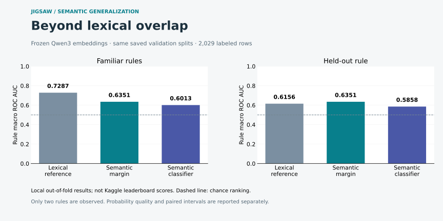

# Frozen semantic benchmark

This is a completed experiment on the **2,029 official competition training rows**, not a leaderboard result. Run `4e7e6c00d269c451c0a3` finished on September 7, 2026. Its source is commit [`6b6e9b1`](https://github.com/alvaromendizabal/jigsaw-rule-classifier/commit/6b6e9b1d472958872670d97cef4910161025ecd7). Later reporting changes preserve its original artifacts and identity.

## Methods

Use frozen Qwen3-Embedding-0.6B, revision `97b0c614be4d77ee51c0cef4e5f07c00f9eb65b3`, with rule-conditioned prompts, CPU float32 inference, last-token pooling, L2 normalization, and a 256-token cap. Model asset hashes and dependency versions are pinned. The provided positive and negative examples share the same text representation as comments. Exact rule/comment pairs are deduplicated before encoding.

Two predeclared methods consume order-invariant similarity features: an untuned positive-minus-negative maximum-similarity margin, transformed with sigmoid temperature 0.1, and a standardized regularized logistic classifier fitted exclusively on retained training-fold rows. The encoder is not fine-tuned. Exact original split memberships and leakage purges are reused. Original raw data, OOF predictions, memberships, portable classifier states, and embedding shards remain private in the project checkpoint storage.

## Outcomes and decision

| Model | Familiar-rule AUC | Held-out-rule AUC | Held-out log loss | Held-out Brier |
| --- | ---: | ---: | ---: | ---: |
| Contextual lexical reference | 0.728672 | 0.615563 | 0.673577 | 0.240487 |
| Frozen semantic margin | 0.635075 | 0.635075 | 0.678621 | 0.242350 |
| Semantic similarity classifier | 0.601294 | 0.585770 | 0.826434 | 0.297618 |

The frozen margin's held-out AUC change is +0.019512, with a 95% paired bootstrap interval of **[−0.013226, +0.049143]**. The gain is not conclusive. Advertising AUC is 0.713518 versus the reference's 0.667263, while legal-advice AUC is 0.556632 versus 0.563862. Probability quality worsens slightly. The learned similarity classifier underperforms the reference, particularly in held-out probability quality. **Neither semantic candidate replaces the lexical reference.**

The margin has identical predictions across protocols because it fits no labeled fold data. Those columns are not independent replications. Intervals use 500 paired draws of normalized comment groups, shared across rules, with seed 2025. They condition on these two rules and fixed OOF predictions, and do not account for future policy diversity or repeated model selection.

## Runtime and reliability

The first successful full invocation took **1,004.707 seconds (16m 45s)**, after model weights were downloaded. Encoding accounted for 983.690 seconds across 1,875 unique inputs, about 1.91 inputs/second on this CPU workload. Peak process RSS was 3.854 GiB. One unique input was truncated. Four CPU inference threads and microbatches of four were used. Hardware-dependent timings are not cloud cost or GPU performance estimates.

Each completed 64-input shard has checksummed vectors, input hashes, statistics, and an atomic completion marker. Completed shards and folds are reusable; interrupted active work restarts at that boundary. The 4 GB Studio app is for reviewing this saved evidence. Fresh Qwen computation requires at least 8 GB RAM and 4 GB currently available.

## Files and reproduction

`metadata.json` hashes the public aggregates and identifies the original run. `results.json` contains all metrics, `uncertainty.json` the paired comparisons, `timing.json` the runtime, `audit.json` data counts, and `provenance.json` a public export of source/data/config identity without row memberships. `integration.json` is a separately labeled authored-example real-model check, not a competition evaluation. The public chart is reproduced by `uv run --extra semantic python scripts/build_semantic_report.py`.

The canonical [notebook 04](../../notebooks/04_semantic_benchmark.ipynb) is already executed with real aggregate outputs. Open it to inspect the evidence; restoring private artifacts is needed only to refresh its displays. The original preview classifier output passes submission schema checks but is not a chosen or scored Kaggle submission. The lexical offline notebook remains the reference submission implementation.

Next: test joint rule/comment encoding, context ablations, and eventually nested calibration. The current evidence does not establish semantic rule understanding, deployment readiness, or competitive medal performance.

[Official Qwen model card](https://huggingface.co/Qwen/Qwen3-Embedding-0.6B) · [Project validation](../../docs/VALIDATION.md) · [Experiment design](../../docs/PHASE_2.md)
